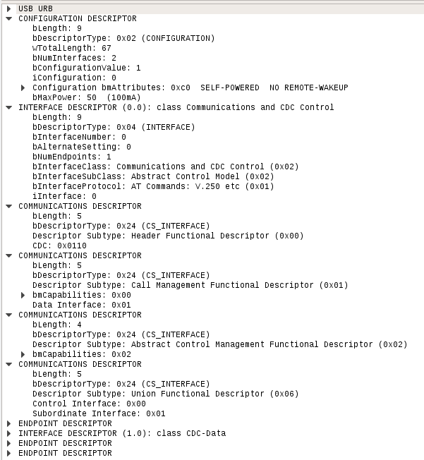

Example minimal CDC project with simple at parsing.

The base for this code is from:
http://stm32f4-discovery.com

# Problem description
Using provided CDC USB device code on STM32 MCUs results in a USB device with
- `bInterfaceSubClass` = 0x02
- `bInterfaceProtocol` = 0x01

If the USB-CDC device returnes following configuration descriptor:

But my Linux-PC no detects a V250 compatible modem on `/dev/ACM0` and tries to get information from it. The V250 modem interface defintition can be downloaded from:

https://www.itu.int/rec/T-REC-V.250/en
further information can be found here:
https://en.wikibooks.org/wiki/Serial_Programming/Modems_and_AT_Commands

In this standard there are mandatory answers to certain AT command defined. As my simple STM32 code does not react to these answers it always takes about 10s till I can open an terminal on this serial device. This is as well descript here:

https://www.rfc1149.net/blog/2013/03/05/what-is-the-difference-between-devttyusbx-and-devttyacmx/

The example code for CDC in STMs example folder is a simple Hack which works - put does not fullfill the claimed standard.

There are now 2 possible solutions:

1. Implement a minimal AT command parser and return proper V250 compatible answers.
2. Findout how FTDI is doing it> But they use a propriatary protocol for their USB-RS232 devices.

This code may help to implement a solution.
